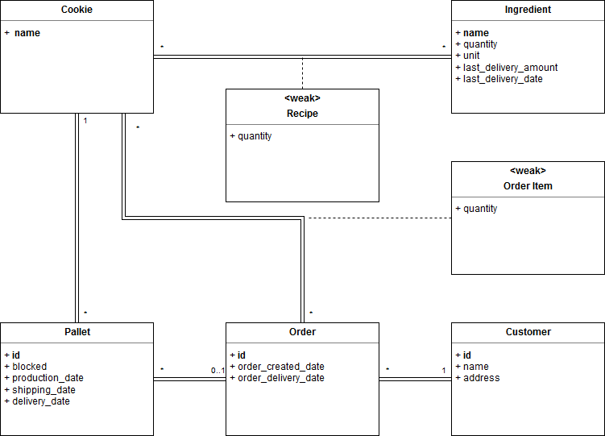

# EDAF75, project report

This is the report for

 + Daniel Regefalk, `ine15dre`
 + Fredrik Olsson, `ine15`
 + Gustav Handmark, ``

We solved this project on our own, except for:

 + The Peer-review meeting
 + ... describe any other help you've gotten ...


## ER-design

The model is in the file [`er-model.png`](er-model.png):

<center>
    
</center>

## Relations

### TODO: 

+ recipes(**recipe_name**)
+ ingredients(**ingredient_name**, unit, total_quantity, last_delivery_amount, last_delivery_date)
+ recipie_ingredients(_recipe_name_, _ingredient_name_)
+ pallets(**pallet_id**, blocked, production_date, shipping_date, delivery_date)
+ orders(**order_id**, order_created_date, order_delivery_date)
+ pallets(**customer_id**, name, address)


## Scripts to set up database

The scripts used to set up and populate the database are in:

 + [`create-schema.sql`](create-schema.sql) (defines the tables), and
 + [`initial-data.sql`](initial-data.sql) (inserts data).

So, to create and initialize the database, we run:

```shell
sqlite3 krusty-db.sqlite < create-schema.sql
sqlite3 krusty-db.sqlite < initial-data.sql
```

(or whatever you call your database file).

## How to compile and run the program

This section should give a few simple commands to type to
compile and run the program from the command line, such as:

```shell
./gradlew run
```

or

```shell
javac -d bin/ -cp src src/krusty/Main.java
java -cp bin:sqlite-jdbc.jar krusty.Main
```

or, if you put your commands into a `Makefile`:

```shell
make compile
make run
```